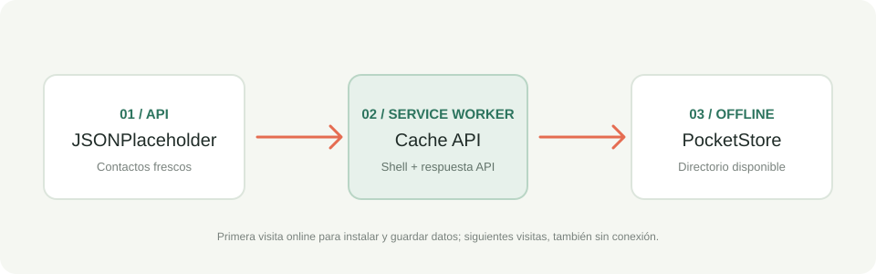
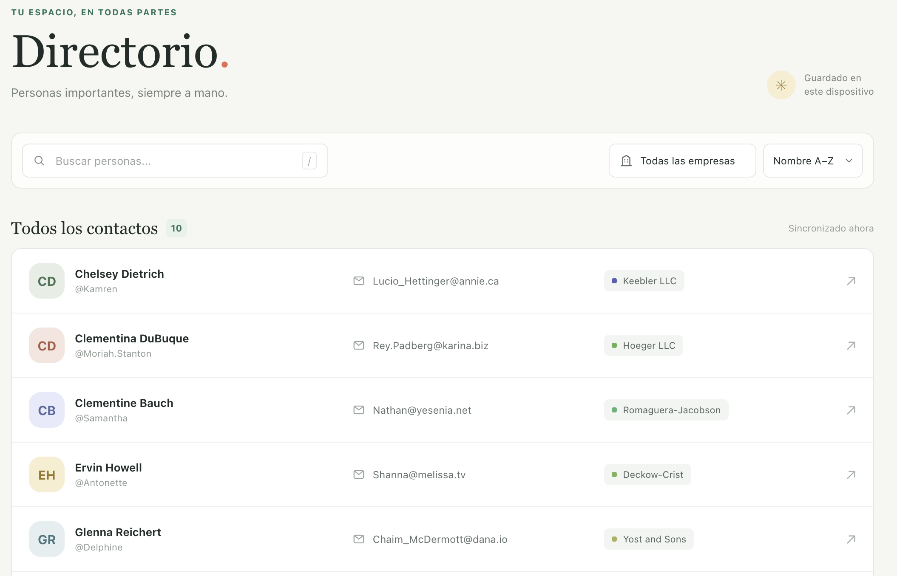
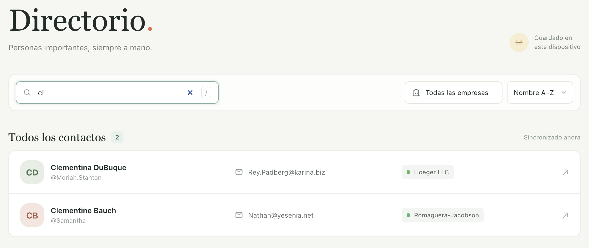
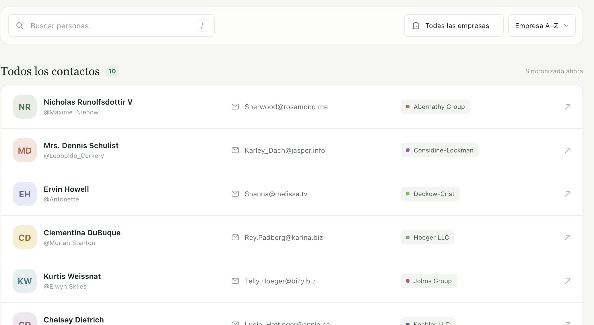
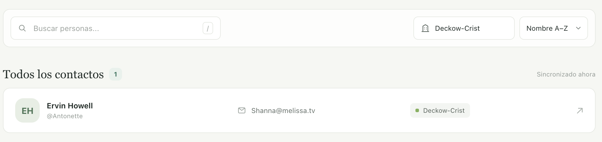
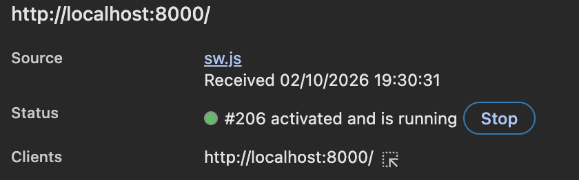
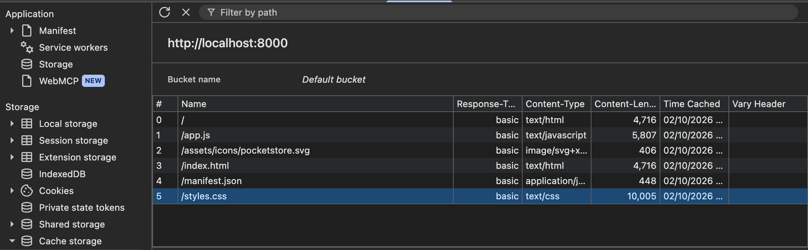
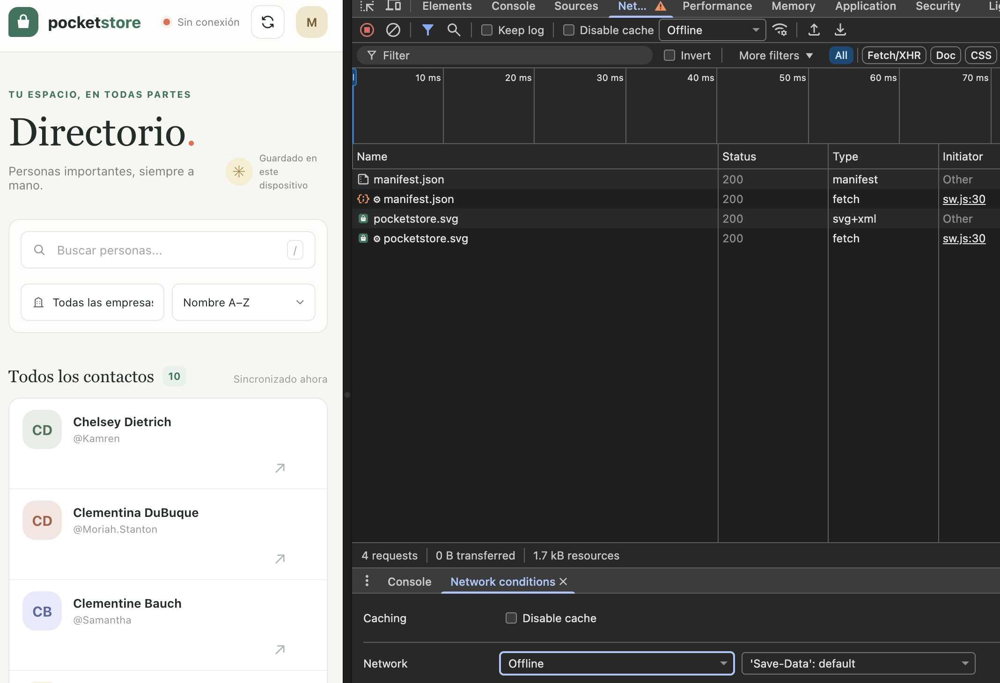
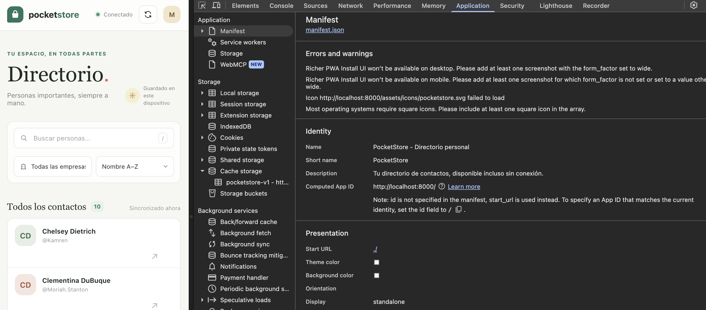

# PocketStore

PocketStore es una aplicación web progresiva (PWA) desarrollada con **HTML, CSS y JavaScript Vanilla**, sin frameworks ni dependencias externas de frontend.

La aplicación muestra un directorio de usuarios obtenido desde **JSONPlaceholder** y utiliza un **Service Worker** para almacenar los recursos de la aplicación y las respuestas de la API, permitiendo consultar la información previamente cargada incluso cuando no hay conexión a Internet.

## Funcionalidades

* Consulta de usuarios desde JSONPlaceholder.
* Búsqueda por nombre, nombre de usuario, correo electrónico y empresa.
* Filtrado por empresa.
* Ordenamiento por nombre o empresa.
* Indicador del estado de conexión.
* Actualización manual de los datos.
* App Shell precargado mediante Service Worker.
* Caché de los recursos principales de la aplicación.
* Caché de la última respuesta válida de la API.
* Funcionamiento offline después de la primera sincronización.
* Manifiesto PWA para permitir la instalación de la aplicación.

## Tecnologías utilizadas

* HTML5
* CSS3
* JavaScript Vanilla
* Service Worker API
* Cache Storage API
* Fetch API
* Web App Manifest
* JSONPlaceholder

## Estructura del proyecto

```text
pocket-store/
│
├── index.html
├── styles.css
├── app.js
├── sw.js
├── manifest.json
│
├── assets/
│   └── icons/
│       └── pocketstore.svg
│
└── docs/
    └── images/
        ├── offline-flow.svg
        ├── 01-aplicacion.png
        ├── 02-busqueda.png
        ├── 03-filtros.png
        ├── 04-service-worker.png
        ├── 05-cache-storage.png
        ├── 06-modo-offline.png
        └── 07-manifest.png
```

## Ejecución

El Service Worker requiere un origen seguro para funcionar. Durante el desarrollo se puede utilizar `localhost`.

Desde la carpeta raíz del proyecto, inicia un servidor estático:

```sh
python3 -m http.server 8000
```

Después abre:

```text
http://localhost:8000
```

La primera ejecución requiere conexión a Internet para obtener los datos de JSONPlaceholder y permitir que el Service Worker almacene los recursos y la respuesta de la API.

Después de que el Service Worker se haya instalado y activado, recarga la aplicación para que tome el control de la página.

Una vez realizada esta primera sincronización, la aplicación puede continuar funcionando utilizando los recursos almacenados en caché.

## Funcionamiento offline

PocketStore utiliza un Service Worker para controlar las solicitudes realizadas por la aplicación.

Durante el evento `install`, se almacenan en caché los recursos esenciales del App Shell:

* `index.html`
* `styles.css`
* `app.js`
* `manifest.json`
* Otros recursos locales necesarios para ejecutar la aplicación.

Durante el evento `activate`, se eliminan versiones anteriores de la caché y el Service Worker toma el control de las páginas disponibles.

Para las solicitudes a JSONPlaceholder se utiliza una estrategia **Network First**:

1. La aplicación intenta obtener los datos desde Internet.
2. Si la solicitud tiene éxito, la respuesta se guarda en caché.
3. Si no existe conexión, se utiliza la última respuesta almacenada.
4. De esta manera, los datos previamente consultados pueden seguir disponibles sin conexión.

Para los recursos locales se utiliza una estrategia de red con respaldo en caché.

Si el navegador solicita una página mientras está desconectado, el Service Worker puede utilizar `index.html` como respaldo para mantener disponible la interfaz de la aplicación.

### Flujo offline

El siguiente diagrama representa el funcionamiento general del sistema:



## Evidencias de funcionamiento

### 1. Aplicación funcionando

La aplicación muestra la interfaz principal y los datos obtenidos desde JSONPlaceholder.



---

### 2. Búsqueda de información

El buscador permite filtrar dinámicamente los registros mostrados en pantalla.



---

### 3. Filtrado y ordenamiento

La aplicación permite filtrar los registros por empresa y modificar el orden de presentación.





---

### 4. Service Worker activo

El Service Worker se encarga de interceptar las solicitudes de la aplicación y aplicar las estrategias de caché.



---

### 5. Recursos almacenados en caché

La aplicación utiliza Cache Storage para conservar recursos y respuestas que pueden ser utilizados posteriormente sin conexión.



---

### 6. Funcionamiento sin conexión

Después de realizar la primera carga con Internet, la aplicación puede utilizar los recursos almacenados por el Service Worker cuando no existe conexión.



---

### 7. Manifiesto PWA

El archivo `manifest.json` contiene la información necesaria para identificar y configurar PocketStore como una aplicación instalable.



## Prueba del funcionamiento offline

Para comprobar el funcionamiento sin conexión:

1. Abrir PocketStore con conexión a Internet.
2. Esperar a que los usuarios sean cargados correctamente.
3. Recargar la página después de que el Service Worker se haya instalado.
4. Abrir las herramientas de desarrollador.
5. Ir a **Network**.
6. Activar el modo **Offline**.
7. Recargar la aplicación.
8. Comprobar que la interfaz y los datos previamente almacenados continúan disponibles.

Esta prueba permite comprobar que la aplicación no depende exclusivamente de una conexión activa después de haber realizado la carga inicial.

## Consideraciones

La API de JSONPlaceholder se utiliza como fuente de datos de demostración. Por este motivo, la primera carga de información requiere conexión a Internet.

El funcionamiento offline depende de que los recursos y la respuesta de la API hayan sido almacenados previamente por el Service Worker.

El Service Worker requiere `localhost` durante el desarrollo o HTTPS cuando la aplicación se despliega en producción.

## Conclusión

PocketStore demuestra la implementación de una aplicación web con capacidades offline mediante tecnologías nativas del navegador.

El proyecto integra un App Shell, consumo de una API mediante `fetch`, Service Worker, Cache Storage y Web App Manifest, permitiendo mantener disponible la aplicación y la información previamente descargada incluso cuando la conexión deja de estar disponible.